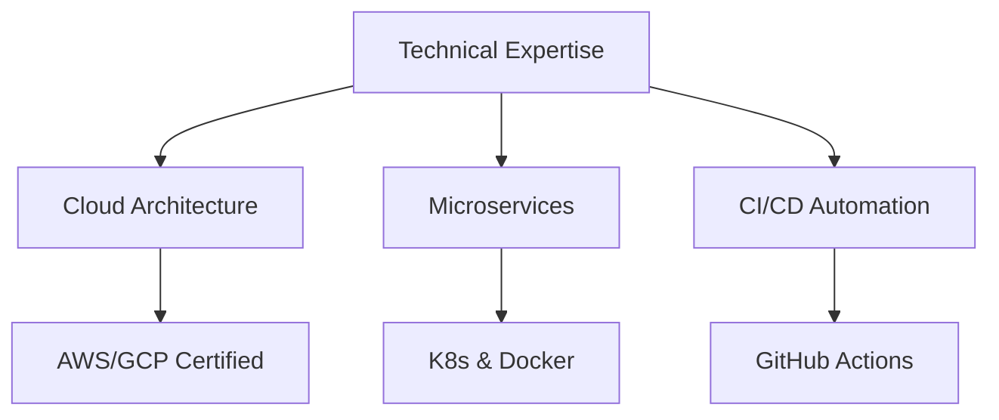
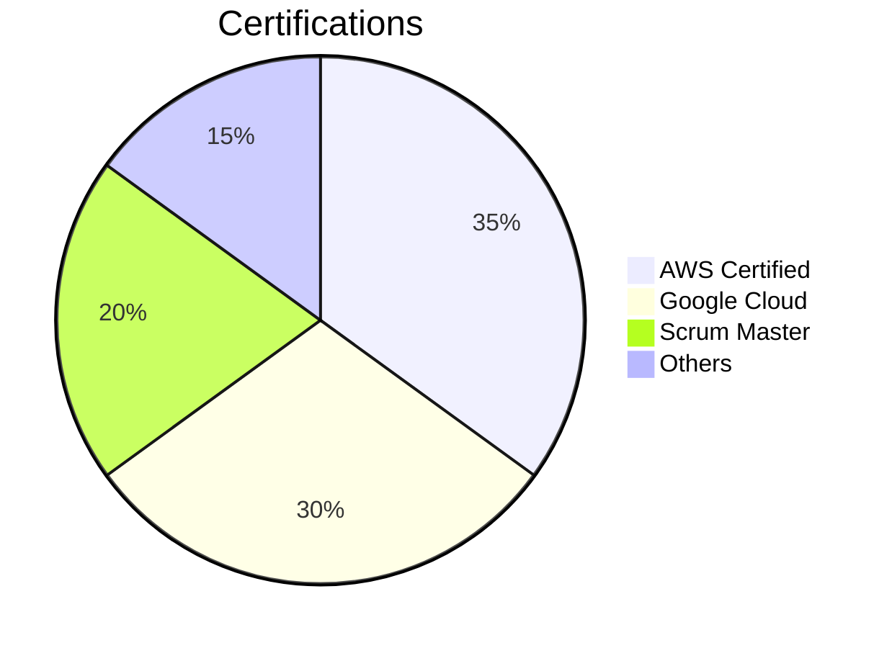

# 𝕽𝖆𝖋𝖆𝖊𝖑 𝕮𝖔𝖗𝖗𝖊𝖎𝖆 | 𝕱𝖚𝖑𝖑𝖘𝖙𝖆𝖈𝖐 𝕰𝖓𝖌𝖎𝖓𝖊𝖊𝖗

  
  
  

    
    
    
    
  

## 🚀 𝕿𝖊𝖈𝖍 𝕻𝖗𝖔𝖋𝖎𝖑𝖊

  

**Technical architect & agile delivery lead - Fullstack** at **Bactolac** | **5+ years** building high-performance systems

## 🛠️ 𝕿𝖊𝖈𝖍 𝕾𝖙𝖆𝖈𝖐

  

## 🌟 𝕿𝖔𝖕 𝕻𝖗𝖔𝖏𝖊𝖈𝖙𝖘

<table>
  <tr>
    <td width="33%">
      <h3>Bactolac System</h3>
      
      
      
      <ul>
        <li>Scaled active users</li>
        <li>40% performance optimization</li>
        <li>Zero-downtime deployments</li>
      </ul>
    </td>
    <td width="33%">
      <h3>DCA Quantum Analytics</h3>
      
      
      
      <ul>
        <li>1M+ daily blockchain transactions with Binance API records</li>
        <li>Real-time dashboards</li>
        <li>Bank-grade security to cryptowallets</li>
      </ul>
    </td>
    <td width="33%">
      <h3>Healthcare System</h3>
      
      
      
      <ul>
        <li>Patient data management</li>
        <li>Cross-platform mobile</li>
        <li>Automated reporting</li>
      </ul>
    </td>
  </tr>
</table>

## 📈 𝕲𝖎𝖙𝖍𝖚𝖇 𝕸𝖊𝖙𝖗𝖎𝖈𝖘

    
  
  
  

## 🏆 𝕬𝖈𝖍𝖎𝖊𝖛𝖊𝖒𝖊𝖓𝖙𝖘

## 🎯 𝕮𝖚𝖗𝖗𝖊𝖓𝖙 𝕷𝖊𝖆𝖗𝖓𝖎𝖓𝖌

  

## 🎸 �𝖊𝖞𝖔𝖓𝖉 𝕮𝖔𝖉𝖊
  

  
  
  

  

